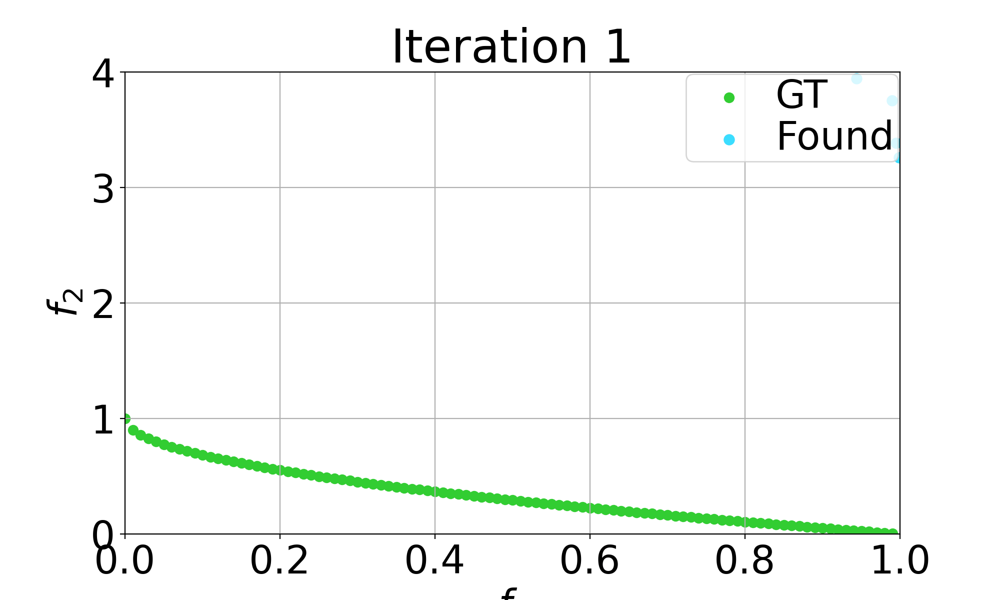
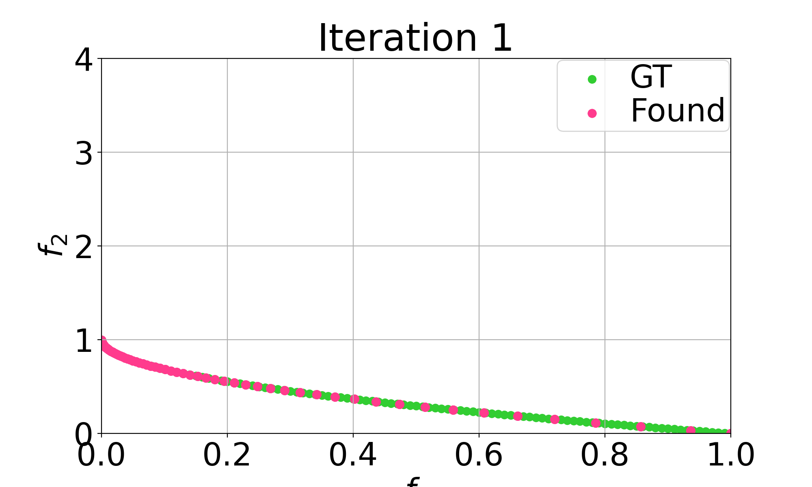

# Weighted-Sum Initialization for NSGA-II

Abhinav Kumar
A61240809

Random Initialization           |  Weighted Sum Initialization
:-------------------------:|:-------------------------:
  |  


### Requirements
1. Python 3.7
2. Pymoo 0.5.0
3. [MATLAB Online](https://matlab.mathworks.com/)

```bash
virtualenv --python=/usr/bin/python3.7 pymo
source pymo/bin/activate
pip install -r requirements.txt
```

### Generate Weighted Sum Initialization

Weighted Sum Initialization uses the `fmincon` in MATLAB. 

Open MATLAB. 
Navigate to the `matlab` folder or add in the current path. Type the following in the command window:

```matlab
main
```

### Running

Navigate to the code folder. Type the following in the command window:
```bash
chmod +x main.sh
./main.sh
```


